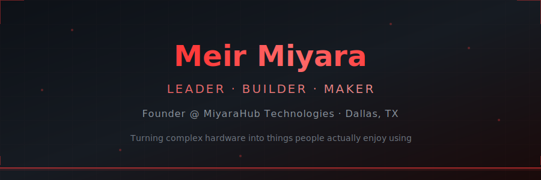

  

  
  
  

  
  
  
  

---

### 👋 Hey

I lead engineering teams by day and build my own products at night. Based in Dallas, TX - most of my work sits at the intersection of **smart home tech**, **AV control**, and **cross-platform mobile apps**. I run [**MiyaraHub Technologies**](https://miyarahub.com), a small studio shipping production software for the IoT and home automation space.

I like solving integration problems - the kind where you have 6 different protocols, 3 APIs that barely work, and a spec PDF from 2009. If it has a network port, I've probably tried to talk to it.

---

## 📱 Apps - Live on Google Play

Production apps built and shipped under [MiyaraHub Technologies](https://miyarahub.com). All cross-platform with Flutter.

<table>
<tr>
<td width="50%" valign="top">

### 🎸 [Elan Audio Lab](https://miyarahub.com/elan-audio-lab/)
Full-stack e-commerce platform for premium custom tube amplifiers. Product catalog, real-time customization, Square + PayPal payments, admin portal, automated email system.

`Flutter` `Supabase` `Square SDK` `PayPal` `Cloudflare`

**→** [Web](https://elanaudiolab.com) · [Google Play](https://play.google.com/store/apps/details?id=com.elanaudiolab.app) · iOS (coming soon)

</td>
<td width="50%" valign="top">

### 🎛️ [AVR Maestro](https://miyarahub.com/avr-maestro/)
Premium controller for Denon & Marantz AV receivers. Volume, inputs, surround modes, multi-zone, HEOS music browsing, Audyssey, Dirac Live, IMAX Enhanced, Auro-3D, Android widgets.

`Flutter` `HTTP` `Telnet` `HEOS`

**→** [Google Play](https://play.google.com/store/apps/details?id=com.miyarahub.avr_maestro) · [Details](https://miyarahub.com/avr-maestro/)

</td>
</tr>
<tr>
<td width="50%" valign="top">

### ⚡ [FuryPath](https://miyarahub.com/fury-path/)
Comprehensive mobile controller for HDFury HDMI processors. EDID management, HDR/Dolby Vision control, CEC/eARC config, JVC macros, real-time signal info - all over Wi-Fi.

`Flutter` `HTTP/SSI` `HDFury API`

**→** [Google Play](https://play.google.com/store/apps/details?id=com.miyarahub.furypath) · [Details](https://miyarahub.com/fury-path/)

</td>
<td width="50%" valign="top">

### 🔋 [UPSight](https://miyarahub.com/upsight/)
UPS monitoring for CyberPower, APC, Eaton, Tripp Lite, and any SNMP-capable device. Real-time battery, power metrics, outlet control, event logging, smart alerts.

`Flutter` `SNMP` `NUT Protocol`

**→** [Google Play](https://play.google.com/store/apps/details?id=com.miyarahub.upsight) · [Details](https://miyarahub.com/upsight/)

</td>
</tr>
<tr>
<td width="50%" valign="top">

### 💾 [Synology Manager](https://miyarahub.com/synology-manager/)
Mobile management for Synology NAS. Real-time CPU, memory, storage, Docker containers, network, surveillance cameras, backup tasks - everything in one dashboard.

`Flutter` `Synology DSM API` `Docker`

**→** [Google Play](https://play.google.com/store/apps/details?id=com.synomanager) · [Details](https://miyarahub.com/synology-manager/)

</td>
<td width="50%" valign="top">

### 🎥 ProjectorPilot *(coming soon)*
Controller for Epson projectors. Power, picture settings, color modes, HDR, lens memory, keystone, lamp hours, OSD navigation - all over Wi-Fi.

`Flutter` `PJLink` `Web Control`

**→** [Details](https://miyarahub.com/projector-pilot/)

</td>
</tr>
</table>

---

## 🔌 Unfolded Circle Integration Ecosystem

The largest third-party integration library for the [Unfolded Circle Remote](https://www.unfoldedcircle.com/) platform. **45+ integrations** connecting AV receivers, music streamers, media players, gaming consoles, smart home devices, projectors, and more to the Remote Two and Remote 3. Plus an **unofficial Android companion app** for the remote itself.

**All integrations are open source and free for the community.** If you find them useful, consider [sponsoring the project](https://github.com/sponsors/mase1981) to help keep development going.

  
  
  
  

### 📱 [UC Remote Android](https://github.com/mase1981/uc-remote-android) - Unofficial Android Companion App

A full-featured native Android companion app for the Unfolded Circle Remote Two and Remote 3. Entity management, real-time WebSocket updates, custom UI pages, profile support, and Wake-on-LAN - built with 100% Kotlin.

`Kotlin` `Android` `REST API` `WebSocket` `Material Design 3`

---

<b>🎬 AV Receivers & Processors</b> - Anthem, ARCAM, Cambridge Audio, Emotiva, JBL, NAD

 

| Integration | Description |
| :--- | :--- |
| [uc-intg-anthemav](https://github.com/mase1981/uc-intg-anthemav) | Anthem Audio/Video processors |
| [uc-intg-arcam](https://github.com/mase1981/uc-intg-arcam) | ARCAM devices |
| [uc-intg-cambridge-audio](https://github.com/mase1981/uc-intg-cambridge-audio) | Cambridge Audio devices |
| [uc-intg-emotiva](https://github.com/mase1981/uc-intg-emotiva) | Emotiva Audio/Video processors |
| [uc-intg-jblav](https://github.com/mase1981/uc-intg-jblav) | JBL MA Series AV Receivers |
| [uc-intg-nadav](https://github.com/mase1981/uc-intg-nadav) | NAD AV devices |

<b>🎵 Audio Streamers & Music</b> - Bluesound, Eversolo, HEOS, MusicCast, Naim, Spotify, WiiM

 

| Integration | Description |
| :--- | :--- |
| [uc-intg-bluesound](https://github.com/mase1981/uc-intg-bluesound) | Bluesound devices |
| [uc-intg-eversolo](https://github.com/mase1981/uc-intg-eversolo) | Eversolo DAC/streamers |
| [uc-intg-heos](https://github.com/mase1981/uc-intg-heos) | Denon/Marantz HEOS multi-room audio |
| [uc-intg-lmserver](https://github.com/mase1981/uc-intg-lmserver) | Lyrion Music Server (Squeezebox) |
| [uc-intg-musiccast](https://github.com/mase1981/uc-intg-musiccast) | Yamaha MusicCast |
| [uc-intg-naim](https://github.com/mase1981/uc-intg-naim) | Naim Audio |
| [uc-intg-spotify](https://github.com/mase1981/uc-intg-spotify) | Spotify playback & controls |
| [uc-intg-wiim](https://github.com/mase1981/uc-intg-wiim) | WiiM Hi-Res Audio streamers |

<b>📺 Media Players & Streaming</b> - Emby, Fire TV, Jellyfin, Plex, R_Volution, VLC

 

| Integration | Description |
| :--- | :--- |
| [uc-intg-emby](https://github.com/mase1981/uc-intg-emby) | Emby media server |
| [uc-intg-firetv](https://github.com/mase1981/uc-intg-firetv) | Amazon Fire TV (IP control, no ADB) |
| [uc-intg-jellyfin](https://github.com/mase1981/uc-intg-jellyfin) | Jellyfin media server |
| [uc-intg-plex](https://github.com/mase1981/uc-intg-plex) | Plex media server |
| [uc-intg-rvolution](https://github.com/mase1981/uc-intg-rvolution) | R_Volution high-end media players |
| [uc-intg-vlcmedia](https://github.com/mase1981/uc-intg-vlcmedia) | VLC Media Player |

<b>📡 TV & Set-Top Boxes</b> - Horizon, Panasonic Viera, Sky Q

 

| Integration | Description |
| :--- | :--- |
| [uc-intg-horizon](https://github.com/mase1981/uc-intg-horizon) | LG Horizon TV boxes (Ziggo/Virgin/UPC) |
| [uc-intg-panasonicviera](https://github.com/mase1981/uc-intg-panasonicviera) | Panasonic Viera TVs |
| [uc-intg-skyq](https://github.com/mase1981/uc-intg-skyq) | Sky Q devices |

<b>🎮 Gaming</b> - Xbox, Xbox Live, Steam

 

| Integration | Description |
| :--- | :--- |
| [uc-intg-xbox](https://github.com/mase1981/uc-intg-xbox) | Xbox console control over IP |
| [uc-intg-xbox-live](https://github.com/mase1981/uc-intg-xbox-live) | Xbox Live game presence display |
| [uc-intg-steam](https://github.com/mase1981/uc-intg-steam) | Steam currently playing + friends list |

<b>🏠 Smart Home & IoT</b> - Bond, Govee, Nanoleaf, SmartThings, UniFi

 

| Integration | Description |
| :--- | :--- |
| [uc-intg-bond](https://github.com/mase1981/uc-intg-bond) | BOND smart devices (fans, shades, fireplaces) |
| [uc-intg-govee](https://github.com/mase1981/uc-intg-govee) | Govee smart lights & devices |
| [uc-intg-nanoleaf](https://github.com/mase1981/uc-intg-nanoleaf) | Nanoleaf light panels |
| [uc-intg-smartthings](https://github.com/mase1981/uc-intg-smartthings) | Samsung SmartThings devices |
| [uc-intg-unifi](https://github.com/mase1981/uc-intg-unifi) | Ubiquiti UniFi Network & Protect |

<b>🎥 Video & Projection</b> - CCTV, Epson PJLink, HDFury, madVR, Monoprice HTP-1

 

| Integration | Description |
| :--- | :--- |
| [uc-intg-cctv](https://github.com/mase1981/uc-intg-cctv) | Security camera viewer |
| [uc-intg-epson-pjlink](https://github.com/mase1981/uc-intg-epson-pjlink) | Epson projectors via PJLink |
| [uc-intg-hdfury](https://github.com/mase1981/uc-intg-hdfury) | HDFury VRRooM HDMI processor |
| [uc-intg-madvr](https://github.com/mase1981/uc-intg-madvr) | madVR video processor |
| [uc-intg-monoprice-htp1](https://github.com/mase1981/uc-intg-monoprice-htp1) | Monoprice HTP-1 processor |

<b>🖥️ PC, Network & Widgets</b> - HTPC, NZB, OctoPrint, Synology, Weather, NASA

 

| Integration | Description |
| :--- | :--- |
| [uc-intg-htpc](https://github.com/mase1981/uc-intg-htpc) | HTPC/Windows system monitor & controls |
| [uc-intg-nzbinfo](https://github.com/mase1981/uc-intg-nzbinfo) | NZB application monitoring |
| [uc-intg-octoprint](https://github.com/mase1981/uc-intg-octoprint) | OctoPrint 3D printer control |
| [uc-intg-synology](https://github.com/mase1981/uc-intg-synology-system) | Synology NAS monitor & controls |
| [uc-intg-weather](https://github.com/mase1981/uc-intg-weather) | Weather forecast display |
| [uc-intg-nasa](https://github.com/mase1981/uc-intg-nasa) | Live NASA data & imagery |

  <a href="https://github.com/mase1981/uc-intg-list"><b>📋 Full Integration Directory →</b></a>

---

## 💝 Support Open Source

All 45+ Unfolded Circle integrations and the Android companion app are **open source and always will be**. They're built for the community and available to everyone for free. If they've been useful to you, sponsoring helps cover development time and keeps new integrations coming.

  
  
  

---

## 🛠️ Tech Stack

  
  
  
  
  
  
  
  
  
  
  
  

---

## 🎵 Music - dj M.a.S.e

  

When I'm not writing code, I'm making music. I produce, sing, and write as **dj M.a.S.e** - original tracks across multiple genres. Available everywhere you stream.

  
  
  
  
  

Also big into home theater and home automation. If it has an IP address and a questionable API, I've probably written a driver for it.

---

  
  

  Built with caffeine and an unreasonable number of protocol specs · <a href="https://miyarahub.com">MiyaraHub Technologies LLC</a> · Dallas, TX

